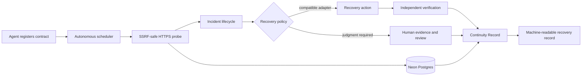

# Continuity

> **By 2028, Gartner predicts 33% of enterprise software applications will include agentic AI—up from less than 1% in 2024.** Agents are being taught to act, buy, ship, and hand work to one another. The missing institution is what happens when one fails. [Source: Gartner](https://www.gartner.com/en/newsroom/press-releases/2025-06-25-gartner-predicts-over-40-percent-of-agentic-ai-projects-will-be-canceled-by-end-of-2027)

**Continuity is autonomous incident response for AI agents.** Agents register a reliability contract; Continuity observes them continuously, opens incidents, executes permitted recovery adapters, verifies the result, and leaves evidence other agents can consume.

**The named enemy:** an autonomous agent fails, everyone sees a different partial story, and recovery starts from guesswork.

> Agents will fail. Silent, unverifiable failure is optional.

Continuity is listed on OKX.AI and is currently available as a **free** A2MCP service. The live demo does not require x402 payment or a funded wallet.

## Why this matters

An agent economy needs more than execution. It needs a way to respond when an agent endpoint disappears, a delivery claim is disputed, or a downstream system cannot confirm what happened.

Today, the outcome is usually a screenshot, a chat thread, and a confidence problem. Continuity creates one operational trail:

```text
DETECT → TRIAGE → VERIFY → RECOVER → LEARN
```

The design follows real incident practice: detect the event, classify impact, gather a timeline, apply a permitted response, and learn from the outcome. What changes in an agent economy is the evidence: endpoint observations, agent-run traces, wallet-signed human observations, and verifiable hashes.

## The product in one sentence

**When an AI agent slips in production, Continuity makes the failure legible and the recovery defensible.**

## A 90-second recovery story

1. A monitored agent fails during real work.
2. Continuity persists the endpoint observation and opens a structured incident.
3. A recovery policy selects and executes a compatible adapter without waiting for a dashboard operator.
4. A follow-up probe independently verifies whether the target is healthy.
5. Humans enter only when policy requires approval or evidence is disputed.
6. Continuity produces a hash-verifiable record of the outcome.

That record is not a vague reputation score. It shows what was observed, what was claimed, what was verified, and what should happen next.

## What exists today

| Capability | Current state | What it proves |
|---|---|---|
| Real agent health checks | Live | Continuity makes real HTTPS requests and persists the observed outcome. |
| SSRF-aware probing | Implemented | Local/private and non-HTTPS targets are rejected. |
| Incident intake | Live | A caller can persist a structured failure claim. |
| Human evidence tasks | Live | A real incident can request a bounded verification task. |
| Browser-wallet signing | Implemented | A verifier can sign an EIP-712 evidence envelope on X Layer (`eip155:196`). |
| Evidence review | Implemented | Only accepted, valid, hash-matched evidence can affect a record. |
| Protected review desk | Implemented | A reviewer can inspect signature/hash state and decide evidence without using curl. |
| Continuity Records | Live | Records are persisted with SHA-256 hashes, confidence, and recommended actions. |
| Incident command timeline | Implemented | Probe, incident, evidence, review, and record events are correlated into one readable history. |
| Operations command center | Implemented | Persisted probes, incidents, evidence tasks, and records are visible in one place. |
| Agent onboarding | Implemented | An agent or operator can register a real HTTPS reliability contract through API, CLI, or web. |
| Automatic incident lifecycle | Implemented | An unhealthy check opens one incident; later probes append observations and a healthy check marks it restored. |
| Autonomous monitor | Implemented | A scheduled worker evaluates every due agent contract without a human opening the app. |
| Policy recovery adapters | Implemented foundation | Compatible agents can authorize automatic recovery; every action and follow-up observation is persisted. |
| Permissionless registry | Implemented | Agents can register themselves through the API, web, or CLI. |
| CLI | Implemented | Registration, checks, incidents, records, worker execution, and A2A requests are terminal-accessible. |
| Capability manifest | Implemented | Agents can discover A2MCP, A2A, autonomy, and pricing details programmatically. |
| Free A2MCP | Live | The demo is callable without payment. |
| OKX.AI listing | Listed | Continuity has passed OKX.AI review and is live on the platform. |

## What Continuity does not claim yet

Truthful boundaries are part of the product.

- It does **not** execute an arbitrary external repair without a compatible registered adapter and recovery policy.
- It does **not** claim a payment took place unless a real payment provider confirms it.
- It does **not** treat a signature as accepted evidence until a reviewer accepts it.
- It does **not** claim the A2A payment/escrow workflow is live; current A2A routes include a trusted verification handoff and state-machine foundation.
- It does **not** use fake uptime history, fake evidence, seed data, or simulated payments.

This is deliberate. A recovery system must be more honest than the systems it is asked to judge.

## Why Continuity is different

| Moment | Status quo | Continuity |
|---|---|---|
| An endpoint fails | A caller gets an error and starts guessing. | A real probe records reachability, status, latency, and content type. |
| A delivery is disputed | Evidence is scattered across screenshots and chat. | Evidence is tied to an incident, content-hashed, wallet-signed, and reviewable. |
| A team needs a decision | A reputation score says “risky” without context. | A Continuity Record explains the incident, confidence, evidence count, and next action. |
| A buyer asks what happened | The agent operator controls the narrative. | Observed facts, submitted claims, and reviewer decisions remain separate. |
| A recovery is complete | The story vanishes after the alert. | A durable record makes the recovery reusable by the next responder or agent. |

## Trust architecture



The trust model is intentionally split:

- **Observe:** Continuity probes a real external endpoint.
- **Claim:** a buyer, agent, or verifier can submit a statement.
- **Verify:** the verifier wallet signature and submitted content hash are checked.
- **Act:** a compatible adapter may execute only what the registered policy permits.
- **Verify:** a separate follow-up observation proves whether recovery succeeded.
- **Escalate:** disputed or judgment-heavy evidence enters protected human review.
- **Record:** system observations and eligible accepted evidence produce a deterministic outcome record.

## OKX.AI integration

| OKX capability | Role in Continuity | What breaks without it |
|---|---|---|
| OKX.AI ASP listing | Discovery and a real agent-native distribution surface | Continuity is only a standalone web API. |
| A2MCP | A standardized, free call surface for reliability checks and workflow APIs | Agent callers need custom integration. |
| X Layer (`eip155:196`) | Consistent chain context for the evidence-signing domain | No shared wallet identity context for verifier signatures. |
| Agentic Wallet-compatible EVM wallet | Signs human observations in the browser | Evidence cannot be attributed to the signing wallet. |
| A2A workflow model | Shapes future negotiated investigation and recovery delivery | Complex recovery is limited to fixed request/response APIs. |

Paid x402 support is retained as an optional future mode. It is not required for the listed free service or the demo.

## API surface

### Core workflow

| Endpoint | Purpose |
|---|---|
| `GET /api/health` | Deployment health check. |
| `POST /api/v1/check-agent-status` | Run and persist a real HTTPS reliability probe. |
| `POST /api/v1/open-incident` | Persist a structured incident. |
| `GET /api/v1/incidents/:id` | Retrieve an incident by ID or public slug. |
| `POST /api/v1/request-human-evidence` | Create a bounded human-verification task. |
| `GET /api/v1/evidence-tasks/:id` | Retrieve verifier instructions and task state. |
| `POST /api/v1/submit-evidence` | Verify and persist signed evidence. |
| `GET /api/v1/evidence-review/queue` | Reviewer queue; protected by reviewer token. |
| `POST /api/v1/evidence-submissions/:id/review` | Accept or reject evidence; protected by reviewer token. |
| `POST /api/v1/issue-continuity-record` | Generate a confidence-scored record from eligible evidence. |
| `GET /api/v1/records/:id` | Retrieve a public record. |
| `GET /api/v1/agents/:id/reliability-profile` | Retrieve an evidence-aware reliability profile. |

### A2A foundation

| Endpoint | Purpose |
|---|---|
| `POST /api/v1/a2a/investigations` | Open a persisted investigation request. |
| `POST /api/v1/a2a/investigations/:id/quote` | Record a budget-bounded quote. |
| `POST /api/v1/a2a/investigations/:id/accept` | Record buyer acceptance pending verified payment. |
| `POST /api/v1/a2a/investigations/:id/payment-verified` | Receive a trusted verification handoff. |
| `POST /api/v1/a2a/investigations/:id/execute` | Run probe/evidence-gated delivery after authorized execution. |
| `POST /api/v1/a2a/investigations/:id/buyer-response` | Record an authorized buyer delivery response. |

## Live demo

- Command center: https://continuity-okx.vercel.app/
- Reviewer desk: https://continuity-okx.vercel.app/review
- Health: https://continuity-okx.vercel.app/api/health
- Free A2MCP entry point: https://continuity-okx.vercel.app/api/v1/check-agent-status

Run a real free probe:

```bash
curl -i -X POST https://continuity-okx.vercel.app/api/v1/check-agent-status \
  -H 'content-type: application/json' \
  --data '{
    "agentName": "Continuity API",
    "endpointUrl": "https://continuity-okx.vercel.app/api/health",
    "expectedStatus": 200,
    "expectedContentType": "application/json",
    "timeoutMs": 8000
  }'
```

Expected behavior: HTTP `200`, a real latency measurement, a persisted `probeId`, and `status: "HEALTHY"` when the endpoint matches the declared contract.

## CLI and machine access

```bash
export CONTINUITY_URL=https://continuity-okx.vercel.app

npm run cli -- capabilities
npm run cli -- agents add --name "Research Coordinator" --url "https://agent.example.com/health" --policy RETRY_AND_ESCALATE
npm run cli -- agents list --json
npm run cli -- incidents list
npm run cli -- a2a open --name "Research Coordinator" --claim "Delivery failed" --instructions "Investigate and return an evidence-backed recovery record"
```

Machine discovery: `GET /.well-known/agent.json` or `GET /api/v1/capabilities`.

## Verification

| Artifact | Evidence |
|---|---|
| Automated tests | 14 tests cover SSRF handling, validation, hashing, evidence eligibility, A2A budgets, free/paid mode selection, and recovery-adapter authorization. |
| Type safety | `npm run typecheck` passes. |
| Production build | `npm run build` passes in default free mode; no payment URL is required. |
| Live deployment | `/api/health` returns HTTP `200`. |
| Live core path | A real probe, incident, evidence task, and preliminary record were created against the deployed service. |
| No fake-data policy | No seed data, synthetic signatures, fabricated payment result, or invented uptime history is used. |

## File-level implementation map

| File | Responsibility |
|---|---|
| `src/probe.ts` | HTTPS probe, DNS safety checks, and SHA-256 helpers. |
| `src/monitoring.ts` | Autonomous observation, incident lifecycle, adapter execution, and recovery verification. |
| `src/db.ts` | Neon Postgres schema and persistence layer. |
| `src/incidents.ts` | Strict schemas for incidents and evidence. |
| `src/payments.ts` | Explicit free mode and optional x402 route protection. |
| `src/records.ts` | Evidence eligibility, verdict generation, and deterministic record hashing. |
| `src/reliability.ts` | Explainable, evidence-aware reliability profile calculation. |
| `src/a2a.ts` | A2A investigation state machine and budget checks. |
| `src/EvidenceSubmissionForm.tsx` | Browser-wallet connect, EIP-712 signing, and submission. |
| `src/AgentOnboardingForm.tsx` | Production agent endpoint onboarding and first contract check. |
| `src/ReviewDesk.tsx` | Protected evidence queue and accept/reject workflow. |
| `src/IncidentActions.tsx` | Follow-up probe, evidence-task, and record actions. |
| `app/page.tsx` | Persisted incident command center. |
| `app/agents/new/page.tsx` | Production agent onboarding workspace. |
| `app/incidents/[id]/page.tsx` | Correlated incident timeline and next actions. |
| `app/review/page.tsx` | Reviewer workspace. |
| `app/evidence-tasks/[taskId]/page.tsx` | Verifier workspace. |
| `app/records/[recordId]/page.tsx` | Public Continuity Record. |
| `app/api/v1/` | Core, review, record, profile, and A2A route handlers. |
| `app/api/cron/monitor/route.ts` | Authenticated autonomous worker entry point. |
| `scripts/monitor-worker.mjs` | Persistent free worker that evaluates due contracts without Vercel Cron. |
| `bin/continuity.mjs` | Agent- and terminal-friendly CLI. |
| `test/probe.test.ts` | 14 focused automated tests. |

## Run locally

```bash
npm install
cp .env.example .env.local
# Set a real Neon DATABASE_URL. Free mode is the default.

npm test
npm run typecheck
npm run build
npm run dev
```

For database-backed routes, provide a real `DATABASE_URL`. Never commit database credentials, reviewer tokens, payment credentials, or wallet secrets.

## The road ahead

Continuity’s next evolution is not “more alerts.” It is safe, observable recovery:

- agent onboarding and recovery-policy configuration;
- agent-run trace ingestion;
- policy-controlled retry, pause, escalation, and fallback recommendations;
- follow-up probes that prove a service is restored;
- privacy-safe recovery replays and reliability badges built from real records;
- real A2A payment/escrow integration only after end-to-end verification.

The standard is simple: **if Continuity cannot prove an event or action happened, it says so.**

## Source material

- [Gartner agentic AI projection](https://www.gartner.com/en/newsroom/press-releases/2025-06-25-gartner-predicts-over-40-percent-of-agentic-ai-projects-will-be-canceled-by-end-of-2027)
- [PagerDuty incident response lifecycle](https://www.pagerduty.com/resources/digital-operations/learn/incident-response-lifecycle-for-devops/)
- [Atlassian major incident management](https://www.atlassian.com/incident-management/itsm/major-incident-management)
- [OpenAI Agents SDK tracing](https://openai.github.io/openai-agents-python/tracing/)
- [OKX.AI A2MCP guide](https://web3.okx.com/onchainos/dev-docs/okxai/howtomcp)
- [OKX.AI A2A guide](https://web3.okx.com/onchainos/dev-docs/okxai/how-to-become-a2a)
- [Continuity product plan](plan.md)
