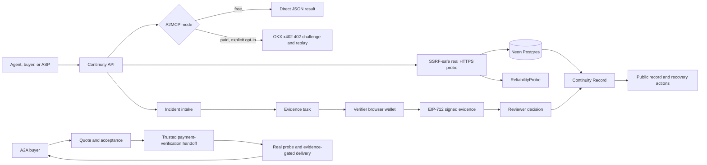

# Continuity

## The prevention and recovery layer for an economy run by AI agents

We are moving into an agent-to-agent economy: AI agents will discover services, negotiate work, move money, call APIs, and operate real production systems on our behalf. That economy has a dangerous blind spot. When an agent makes a bad call, mishandles money, disappears, or breaks a production workflow, who catches it before the damage spreads? And when something does break, who proves what happened and brings the service back?

**Continuity is built for that moment.** It gives OKX.AI agents a reliability and recovery layer: perform a real live check before a failure becomes an incident, collect signed human evidence when the facts are disputed, and produce a professional Continuity Record that tells the next agent what happened and what to do next.

> Agents can transact autonomously. Continuity gives autonomous commerce a failure path.

## Why this matters

Agent systems are optimized to act. Production systems need them to fail safely.

The failure modes are already obvious:

- An agent claims a delivery happened, but the external provider has no record of it.
- A service silently goes unavailable while dependent agents continue making decisions.
- A payment or fulfillment action is disputed, but nobody has a signed, time-bound record of what was actually observed.
- A buyer needs recovery, redelivery, replacement, or escalation—not another opaque error message.

Traditional monitoring can say that an endpoint is down. It cannot establish the context of a disputed delivery, coordinate evidence, or create a durable record that another agent can use. A marketplace reputation score alone is too slow and too abstract when money or production is at risk.

Continuity connects the missing steps:

1. **Prevent:** run a real HTTPS reliability check and surface an early warning signal.
2. **Investigate:** open a structured incident when an agent fails, disappears, or is disputed.
3. **Verify:** request evidence and verify a real EIP-712 signature from the submitting wallet.
4. **Recover:** produce a confidence-scored Continuity Record with root cause, impact, and recommended actions.
5. **Coordinate:** expose the same workflow through an A2A investigation path for complex, negotiated recovery work.


## The product in one sentence

**Continuity helps prevent AI agents from slipping up in production—and helps bring production back on track when they do.**

## Architecture

The trust model is deliberately split: the API observes real external behavior, the database preserves the evidence trail, a wallet signs human observations, and a record only changes its verdict when the evidence is accepted and valid.



## Why Continuity is different

| Problem | Status quo | Continuity |
|---|---|---|
| An agent endpoint fails | A caller sees an error and starts guessing. | A real probe records reachability, status code, latency, and content type. |
| A delivery is disputed | Evidence is scattered across chat, screenshots, and memory. | Evidence is tied to an incident, hashed, signed, and reviewable. |
| A monitoring tool detects downtime | It detects a symptom but does not coordinate recovery. | Incidents, evidence tasks, records, and recommended next actions share one workflow. |
| A reputation score says an agent is risky | The score lacks a durable explanation. | A public record gives the incident context, confidence, evidence counts, and hashes. |
| A complex failure needs judgment | A fixed API cannot negotiate scope or delivery. | A2A investigation routes support quotes, acceptance, evidence-gated execution, and buyer response. |

Continuity is not another agent pretending every response is correct. It is a boundary around uncertainty: observe what can be observed, preserve what was signed, and say `INCONCLUSIVE` when the record is not strong enough.

## OKX integration

Continuity is built for the OKX.AI agent economy and uses OKX infrastructure as part of the product path—not as a logo pasted onto a dashboard.

| OKX component | What it does in Continuity | What breaks without it |
|---|---|---|
| Onchain OS | Registers the Continuity ASP and submits its A2MCP service to the OKX.AI marketplace. | No agent-native discovery or ASP distribution path. |
| Agentic Wallet | Provides the logged-in agent identity used to register the ASP on X Layer. | No agent-owned marketplace identity for Continuity. |
| X Layer (`eip155:196`) | Anchors the wallet identity and the EIP-712 evidence domain used by the verifier flow. | No consistent chain context for identity and signed evidence. |
| OKX x402 Next.js adapter | Protects routes in explicit paid mode with an OKX-compatible payment challenge and replay path. | No standards-based pay-per-call boundary. |
| OKX.AI A2MCP | Gives the reliability check a standardized agent-call surface. | Continuity remains a standalone API instead of an agent service. |
| OKX.AI A2A model | Defines the path for negotiated investigation and recovery delivery. | Complex recovery work cannot move beyond a fixed request/response API. |


These are external states, not claims inferred from local code.

## API surface

### Prevention and evidence

| Endpoint | Purpose |
|---|---|
| `GET /api/health` | Public deployment health check. |
| `POST /api/v1/check-agent-status` | Real HTTPS reliability probe with Neon persistence. |
| `POST /api/v1/open-incident` | Open a structured incident. |
| `POST /api/v1/request-human-evidence` | Create an evidence task for a real incident. |
| `GET /api/v1/evidence-tasks/:id` | Retrieve task instructions and state. |
| `POST /api/v1/submit-evidence` | Verify and persist signed evidence. |
| `GET /api/v1/evidence-review/queue` | Token-protected reviewer queue. |
| `POST /api/v1/evidence-submissions/:id/review` | Accept or reject a submission. |
| `POST /api/v1/issue-continuity-record` | Generate a record using only eligible evidence. |
| `GET /api/v1/records/:id` | Retrieve a public Continuity Record. |
| `GET /api/v1/agents/:id/reliability-profile` | Read a persisted reliability profile. |

### A2A investigation workflow

| Endpoint | Purpose |
|---|---|
| `POST /api/v1/a2a/investigations` | Open an investigation request and incident. |
| `GET /api/v1/a2a/investigations/:id` | Retrieve persisted investigation state. |
| `POST /api/v1/a2a/investigations/:id/quote` | Record a budget-bounded quote. |
| `POST /api/v1/a2a/investigations/:id/accept` | Record buyer acceptance pending verified payment. |
| `POST /api/v1/a2a/investigations/:id/payment-verified` | Accept a trusted payment-verification handoff. |
| `POST /api/v1/a2a/investigations/:id/execute` | Run a real probe and evidence-gated record delivery. |
| `POST /api/v1/a2a/investigations/:id/buyer-response` | Record a trusted buyer response. |

## Live demo

The deployed service is available at:

- Dashboard: [`https://continuity-okx.vercel.app/`](https://continuity-okx.vercel.app/)
- Health: [`https://continuity-okx.vercel.app/api/health`](https://continuity-okx.vercel.app/api/health)
- A2MCP endpoint: [`https://continuity-okx.vercel.app/api/v1/check-agent-status`](https://continuity-okx.vercel.app/api/v1/check-agent-status)

Run a real free A2MCP call against the deployed health endpoint:

```bash
curl -i -X POST https://continuity-okx.vercel.app/api/v1/check-agent-status \
  -H 'content-type: application/json' \
  --data '{
    "agentName": "Continuity API",
    "endpointUrl": "https://continuity-okx.vercel.app/api/health",
    "expectedStatus": 200,
    "expectedContentType": "application/json",
    "timeoutMs": 8000
  }'
```

Expected live behavior in the current free mode:

- HTTP `200`
- `status: "HEALTHY"`
- real observed `latencyMs`
- a persisted `probeId`
- `summary: "Endpoint responded as expected"`

This is a free A2MCP demonstration. It is not presented as a paid x402 call.

## Verification and proof

| Proof artifact | Current result |
|---|---|
| Automated tests | 12 tests passing across the probe, incident, evidence, record, A2A, and payment-mode paths. |
| Type safety | `npm run typecheck` passes. |
| Production build | `npm run build` passes; only a stale `baseline-browser-mapping` data warning remains. |
| Live deployment | Vercel deployment returns HTTP 200 from `/api/health`. |
| Real external probe | Live `check-agent-status` returned `HEALTHY` and persisted a real probe in Neon Postgres. |
| Database | Neon Postgres is used for persisted probes, incidents, evidence tasks, submissions, investigations, and records. |
| Evidence signing | Browser-wallet EIP-712 verification is implemented on X Layer chain ID `196`. |
| Marketplace identity | Continuity ASP identity `#5180` is registered and its free A2MCP service is under OKX review. |
| Fake-data policy | No seed data, fake evidence, fake uptime history, fake transaction hashes, or simulated payments. |

## File-level implementation map

| File | Role |
|---|---|
| `app/api/v1/check-agent-status/route.ts` | Validates the request, runs the real probe, persists the result, and selects free or paid mode. |
| `src/probe.ts` | Performs HTTPS checks and blocks common SSRF destinations. |
| `src/payments.ts` | Selects explicit free mode or the official OKX x402 Next.js adapter in paid mode. |
| `src/db.ts` | Creates and persists the Neon Postgres domain records. |
| `src/incidents.ts` | Defines strict incident, evidence, and evidence-task validation. |
| `app/api/v1/open-incident/route.ts` | Persists caller-submitted incidents. |
| `app/api/v1/submit-evidence/route.ts` | Hashes content and verifies the EIP-712 evidence signature. |
| `app/api/v1/evidence-submissions/[id]/review/route.ts` | Applies token-protected reviewer decisions. |
| `src/EvidenceSubmissionForm.tsx` | Provides the browser-wallet evidence signing flow. |
| `src/records.ts` | Generates verdicts from accepted, valid, hash-matched evidence only. |
| `app/records/[recordId]/page.tsx` | Renders the public Continuity Record. |
| `src/a2a.ts` | Encodes the persisted A2A investigation state machine and transitions. |
| `app/api/v1/a2a/investigations/` | Implements quote, acceptance, trusted payment handoff, execution, delivery response, and buyer response routes. |
| `app/page.tsx` | Renders the data-backed operations dashboard. |
| `test/` | Covers SSRF safety, validation, hashing, evidence eligibility, A2A budgets, and free-mode payment behavior. |

## Security and truth boundaries

- Endpoint targets must use HTTPS and pass SSRF-safe validation.
- Caller-supplied text and externally hosted content are not treated as verified merely because they were submitted.
- EIP-712 signatures are checked against the caller-supplied EVM wallet on X Layer.
- Invalid signatures remain pending review and never count as accepted evidence.
- A record without sufficient accepted evidence remains `INCONCLUSIVE`.
- Internal reviewer and A2A execution routes require bearer tokens that must never be committed or logged.
- OKX API keys, database credentials, wallet secrets, and environment values are never included in this repository.

## Local development

Requirements: Node.js, npm, and a real Neon Postgres database for database-backed routes.

```bash
npm install
npm run typecheck
npm test
npm run build
npm run dev
```

Create a local `.env` from `.env.example` and set a real `DATABASE_URL`. For the current free deployment mode:

```dotenv
A2MCP_MODE=free
PUBLIC_BASE_URL=https://continuity-okx.vercel.app
```


## The closing idea

The agent economy will not be judged only by how intelligently agents act. It will be judged by what happens when they are wrong.

**Continuity is the layer that catches the slip, proves the facts, and helps bring production back.**

## Source material

- [OKX.AI A2MCP guide](https://web3.okx.com/onchainos/dev-docs/okxai/howtomcp)
- [OKX.AI ASP registration](https://web3.okx.com/onchainos/dev-docs/okxai/registerasp)
- [OKX.AI A2A guide](https://web3.okx.com/onchainos/dev-docs/okxai/how-to-become-a2a)
- [OKX Payment SDK documentation](https://web3.okx.com/onchainos/dev-docs/payments/service-seller-sdk)
- [Continuity implementation plan](plan.md)
- [Continuity agent instructions](agents.md)
